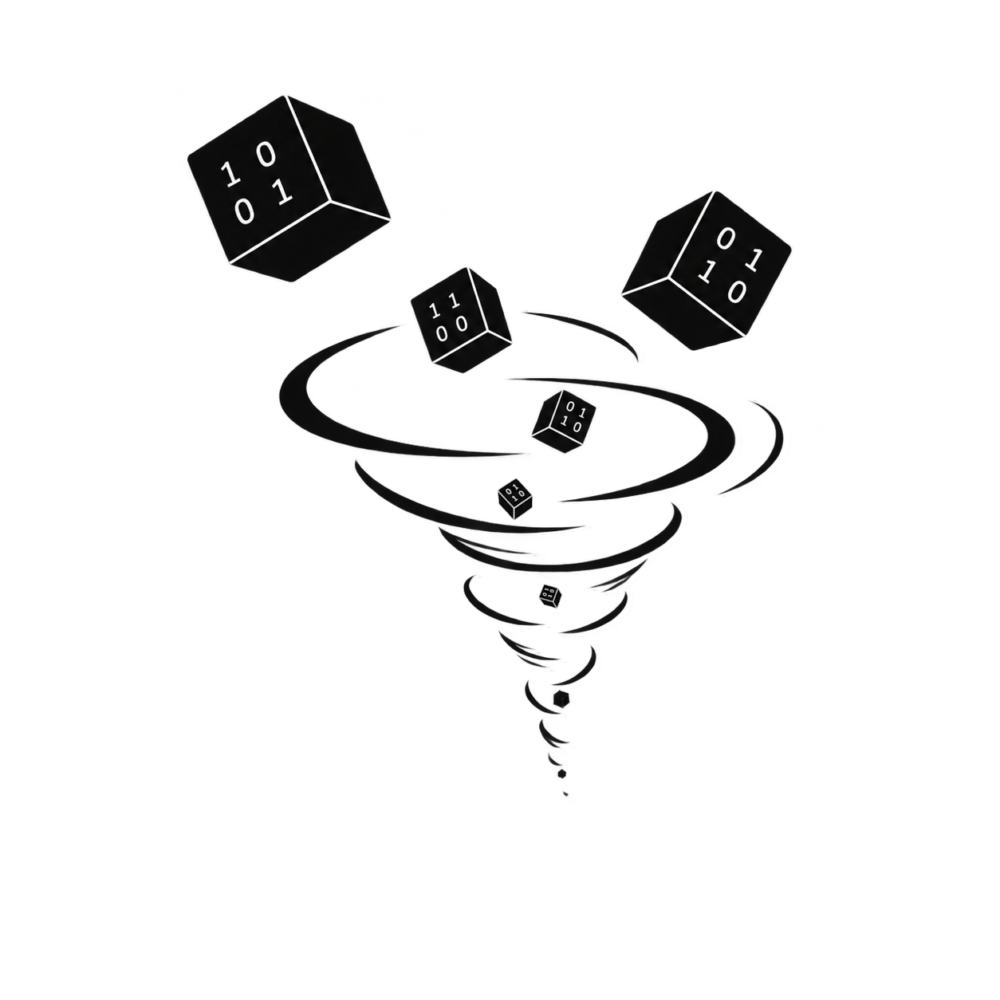

<h1 align="center">TNR - WorkspaceSerializer</h1>

<p align="center">
  <b>A lightweight Roblox Studio serializer for saving, exporting, and restoring Instance hierarchies.</b>
</p>

<p align="center">
  
  
  
</p>

<p align="center">
  
  
  
</p>

<p align="center">
  
  
  
</p>
<p align="center"></p>

> [!IMPORTANT]
> Independent, unofficial project. Not affiliated with, endorsed by, or officially connected to Roblox Corporation. "Luau" is a trademark of Roblox Corporation.
<br></br>
# Load the script

```lua
local loadTNR = loadstring(game:HttpGet("https://raw.githubusercontent.com/Bondpley/Tooling-Node-Runtime-WorkspaceSerializer/refs/heads/main/ToolingNodeRuntimeWorkspaceSerializer.luau", true))
local tnr = loadTNR()

tnr({
    mcs = 180000,
    webhookUrl = "https://example.com",
    pcps = true,
    ccolor = Color3.fromRGB(255, 255, 255),
    yieldsc = 9999
})
```

<br></br>
> [!IMPORTANT]
> ## Disclaimer
> This project is provided for development, testing, debugging, archival, educational, and research purposes.<br>
> It is not intended to facilitate misuse, unauthorized access, abuse of third-party services, violation of platform rules, or unauthorized redistribution of content.<br>
> Users are solely responsible for ensuring that their use of this software complies with all applicable laws, terms of service, licenses, and platform rules.<br>
> The maintainers do not support, encourage, or condone any misuse of this software and are not responsible for how it is used by others.<br>

---
# License

Distributed under the license included in this repository.

See [`LICENSE`](LICENSE) for more information.

---

<p align="center">
  <sub>TNR - Tooling & Node Runtime</sub>
  <br>
  <sub>WorkspaceSerializer • Roblox Studio</sub>
</p>


[1]: https://d2gbj0c64xar4a.cloudfront.net/docs/studio/ui-overview "Studio interface | Documentation - Roblox Creator Hub"
